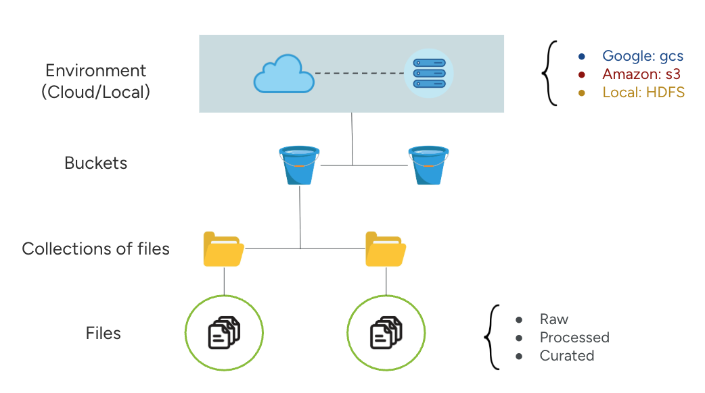

# Lakehouse App - R Lib

This R lib supports the access to the lakehouse app via R scripts

## 📌 Installation and usage

To intall the library you first need to install the devtools package:

```r
install.packages("devtools")
library("devtools")
```

To install the lakehouse library, run:

```r
devtools::install_github(
  "danilo-dcs/lakehouse-R-package",
  upgrade = "always",
  dependencies = TRUE,
  quiet = TRUE,
  repos = "https://cloud.r-project.org"
)
```

To import the main class add the following code into your script:

```r
library(LakehouseClient)
```

To use the lakehouse functionalities create an instance of LakehouseClient by running:

```r
client <- setup_client("https://lakehouse-api.pathotrack.health")
```

_If you are facing issues to install the LakehouseClient library and it's dependencies on RStudio, please try to create a new empty RStudio project and the import the LakehouseClient library_.
_Alternativelly, you can also set up an R environment on Google Colab or Jupyter_.

## 🚨 Supported Environments for Data Storage

1. Google Cloud Storage (gcs)
2. Amazon S3 (s3)
3. Self Hosted Apache Hadoop (hdfs)


## 🏠 Lakehouse Data Storage Structure

The lakehouse storage structure is divided in three levels: 
- (1) The bucket where the collections of files will be phisically stored, 
- (2) The collections are a logical group of files (similarly to a github repository of files grouped for the same logical purpose).
- (3) The files



## 📚 Function Index <a name="index"></a> 

### Authentication

- [client$auth()](#clientauth)

### Creating collection

- [client$create_collection()](#clientcreate_collection)

### Downloading files

- [client$download_file()](#clientdownload_file)

### Fetching dataframe

- [client$get_dataframe()](#clientget_dataframe)

### Listing collections, files and buckets

Collections:
- [client$list_collections()](#clientlist_collections)
- [client$list_collections_json()](#clientlist_collections_json)<br><br>

Files:
- [client$list_files()](#clientlist_files)
- [client$list_files_json()](#clientlist_files_json)<br><br>

Buckets:
- [client$list_buckets()](#clientlist_buckets)
- [client$list_buckets_json()](#clientlist_buckets_json)<br><br>


### Uploading data

- [client$upload_dataframe()](#clientupload_dataframe)
- [client$upload_file()](#clientupload_file)

### Basic search 

- [client$search_collections_by_keyword()](#clientsearch_collections_by_keyword)
- [client$search_files_by_keyword()](#clientsearch_files_by_keyword)

### Advanced search query

- [client$search_collections_query()](#clientsearch_collections_query)
- [client$search_files_query()](#clientsearch_files_query)

## 🔧 Function Details

### `client$auth()` <a name="clientauth">:</a> [_\[click here to go back to the top\]_](#index)

**Basic Example:**
```r
client$auth(email="your_email@mail.com", password="PASS")
```

**Description:**  
Authenticates the user based on login details. It returns the authentication token.

**Arguments:**

- email: A string containing the user email
- password: A string containing the user's password


---

### `client$create_collection()` <a name="clientcreate_collection">:</a> [_\[click here to go back to the top\]_](#index)

**Basic Example:**
```r
client$create_collection(
  collection_name="YOUR_COLLETION_NAME", 
  storage_type="gcs", 
  bucket_name="AVAILABLE_STORAGE_BUCKET_NAME"
)
```

**Description:**  
Creates a new collection of files. Returns the newly created collection details.

**Parameters:**

- `collection_name`: name for the new collection
- `storage_type`: storage type for the collection ('gcs', 's3', 'hdfs')
- `bucket_name`: required for GCP/S3/HDFS
- `collection_description [Optional]`: text description
- `public [Optional]`: marks the collection as public
- `secret [Optional]`: marks the collection as secret

**Returns:**

- A dictionary containing the collection item in the catalog


---

### `client$download_file()` <a name="clientdownload_file">:</a> [_\[click here to go back to the top\]_](#index)

**Basic Example:**
```r
client$download_file(
  catalog_file_id="0197ead3-028c-797e-8717-5441be78a0e4", 
  output_file_dir="LOCAL_COMPUTER_PATH"
)
```

**Description:**  
Downloads a file from the lakehouse catalog using its catalog ID. Returns the local path where the file was saved.

**Parameters:**

- `catalog_file_id`: the file id
- `output_file_dir`: the local dir where the output file will be placed at

**Returns:**

- A string containing the output file address


---

### `client$get_dataframe()` <a name="clientget_dataframe">:</a> [_\[click here to go back to the top\]_](#index)

**Basic Example:**
```r
client$get_dataframe(catalog_file_id="0197ead3-028c-797e-8717-5441be78a0e4")
```

**Description:**  
Fetches a file from storage and loads it as an R-formatted dataframe.  

**Condition:**  
Only works if the catalog marks the file as 'structured' (or file format is CSV, XLSX, TSV, JSON, MD, HTML, TEX, or PARQUET).  

**Parameters:**

- `catalog_file_id`: the file ID in the catalog

**Returns:**

- It returns a pandas dataframe of the desired file


---

### `client$list_collections()` <a name="clientlist_collections">:</a> [_\[click here to go back to the top\]_](#index)

**Basic Example:**
```r
client$list_collections()
```

**Description**
List all available collections in the storage.

**Arguments**

- sort_by_key (Optional): String containing the key parameter to be the sorting reference, default is inserted_at (date of insertion)
- sort_desc (Optional): Boolean value indicating TRUE or FALSE for sorting descendently

**Returns**
Returns a table-formatted string with the collections records. cat() command is recommended to visualize the formatted table


---

### `client$list_collections_json()` <a name="clientlist_collections_json">:</a> [_\[click here to go back to the top\]_](#index)

**Basic Example:**
```r
client$list_collections_json()
```

**Description**
List all available collections in the storage.

**Arguments**

- sort_by_key (Optional): String containing the key parameter to be the sorting reference, default is inserted_at (date of insertion)
- sort_desc (Optional): Boolean value indicating TRUE or FALSE for sorting descendently

**Returns**
Returns a json-formatted string with the collections records


---

### `client$list_files()` <a name="clientlist_files">:</a> [_\[click here to go back to the top\]_](#index)

**Basic Example:**
```r
client$list_files()
```

**Description**:

List files in the storage. Useful for exploring available resources before querying or downloading.

**Arguments**

- include_raw (Optional): Boolead flag indicating if results will whether include raw files
- include_processed (Optional): Boolead flag indicating if results will whether include processed files
- curated (Optional): Boolead flag indicating if results will whether include curated files
- sort_by_key (Optional): String containing the key parameter to be the sorting reference, default is inserted_at (date of insertion)
- sort_desc (Optional): Boolean value indicating TRUE or FALSE for sorting descendently

**Returns:**

- It returns a table-formatted string with the files in the catalog. cat() command is recommended to visualize the formatted table


---

### `client$list_files_json()` <a name="clientlist_files_json">:</a> [_\[click here to go back to the top\]_](#index)

**Basic Example:**
```r
client$list_files_json()
```

**Description**:

List files in the storage. Useful for exploring available resources before querying or downloading.

**Arguments**

- include_raw (Optional): Boolead flag indicating if results will whether include raw files
- include_processed (Optional): Boolead flag indicating if results will whether include processed files
- curated (Optional): Boolead flag indicating if results will whether include curated files
- sort_by_key (Optional): String containing the key parameter to be the sorting reference, default is inserted_at (date of insertion)
- sort_desc (Optional): Boolean value indicating TRUE or FALSE for sorting descendently

**Returns:**

- It returns a json-formatted string with the files in the catalog


---

### `client$list_buckets()` <a name="clientlist_buckets">:</a> [_\[click here to go back to the top\]_](#index)

**Basic Example:**
```r
client$list_buckets()
```


**Description**:
List all buckets accessible by the user. Buckets represent logical data storage partition.

**Returns:**

- It returns a table-formatted string containing all the storage buckets in the system, cat() command is recommended to visualize the formatted table


---

### `client$list_buckets_json()` <a name="clientlist_buckets_json">:</a> [_\[click here to go back to the top\]_](#index)

**Basic Example:**
```r
client$list_buckets_json()
```

**Description**:
List all buckets accessible by the user. Buckets represent logical data storage partition.

**Returns:**

- It returns a json-formatted string containing all the storage buckets in the system

---

### `client$upload_dataframe()` <a name="clientupload_dataframe">:</a> [_\[click here to go back to the top\]_](#index)

**Basic Example:**
```r
client$upload_dataframe(
  df=df_variable,
  df_name="DATASET_NAME", 
  collection_catalog_id="0197eada-cedb-77d5-8935-b319b59fae02"
)
```

**Description**:

Uploads a dataframe from your R environment/code:

- Upload token
- Credential ID
- Local dataframe file path to be uploaded

**Arguments**:

- df: A dataframe (or named list) to be uploaded

- `df_name`:  
  The name of the dataframe (without file extension). The dataframe will be stored as a CSV file by default.

- `collection_catalog_id`:  
  The identifier of the collection (from the collection catalog) where the file will be stored.

- `file_description` _(Optional)_:  
  Additional description for the file.

- `dataframe_version` _(Optional, default: `1`)_:  
  Version number of the dataframe in the system.

- `public` _(Optional, default: `False`)_:  
  Visibility setting. If `True`, the dataframe will be publicly visible to all users in the catalog.

- `processing_level` _(Optional, default: `raw`)_:  
  Indicates the processing level of the dataframe (e.g., `raw`, `processed`, etc.).


---

### `client$upload_file()` <a name="clientupload_file">:</a> [_\[click here to go back to the top\]_](#index)

**Basic Example:**
```r
client$upload_file(
  local_file_path="/Desktop/files/sample/sequences.fasta", 
  final_file_name="sequences_dengue.fasta",
  collection_catalog_id="0197eada-cedb-77d5-8935-b319b59fae02",
  file_category="unstructured"
)
```

**Description:**  
Set up a new file to be uploaded from local storage. It returns the catalog item for the new file uploaded.  

**Arguments:**

- `local_file_path`: the local path to the file to be uploaded
- `final_file_name`: the output file name in the storage
- `collection_catalog_id`: the collection identifier, from the collection catalog, where the file will be placed
- `file_category`: the file class must indicate if the file is 'structured' or 'unstructured'; default is 'unstructured'
- `file_description [Optional]`: Additional description for the file
- `file_version [Optional, default 1]`: Version number for version control
- `public [Optional, default False]`: If public, the file is visible to all users
- `processing_level [Optional, default "raw"]`: The processing level ("raw", "processed", "curated")

**Returns:**

- A dictionary containing the file id in the catalog and the file name

---

### `client$search_collections_by_keyword()` <a name="clientsearch_collections_by_keyword">:</a> [_\[click here to go back to the top\]_](#index)

**Basic Example**:

```r
client$search_collections_by_keyword(keyword="clinical reports")
```

**Description**: Search the collections in the catalogue by keyword. Enables discovery of collections of datasets based on a specified keyword

**Arguments**:

- keyword (str): A string containing the string keyword to match with the collection names (collection_name)

**Returns:**

- It returns the collections reccords in the specified output format.

---

### `client$search_files_by_keyword()` <a name="clientsearch_files_by_keyword">:</a> [_\[click here to go back to the top\]_](#index)

**Basic Example**:

```r
client$search_files_by_keyword(keyword="genome")
```

**Description**: Search the files in the catalogue by keyword. Enables discovery of files of datasets based on a specified keyword

**Function Arguments**:

- keyword (str): A string containing the string keyword to match with the file names

**Returns:**

- It returns the files reccords in the specified output format.

---

### `client$search_collections_query()` <a name="clientsearch_collections_query">:</a> [_\[click here to go back to the top\]_](#index)


1. The following **example** searches any collection that contains the word 'covid' in its name using the wildcard operator `*`.
```r
client$search_collections_query('collection_name*covid')
```

2. The following **example** search for any collection named `covv_patient_data`, inserted_by equals `0197eae8-bc59-7ac4-80b3-81bfec379f7e:user1@gmail.com` and inserted_at greater than `1747934722` (date in miliseconds)
```r
client$search_collections_query(
  'collection_name=covv_patient_data',
  'inserted_by=0197eae8-bc59-7ac4-80b3-81bfec379f7e:user1@gmail.com',
  'inserted_at>1747934722'
)
```

**Description**: Query the collections in the catalogue based on query parameters. Enables discovery of collections of datasets based on a specified keyword

**Returns:**

- It returns the collection records in the specified parameters

**Arguments**:

- ...: String args containing the search terms

**Search Terms Structure**:

`SEARCH_PARAMETER <OPERATOR> VALUE`

- SEARCH_PARAMETER: must be one of the query parameters listed below
- OPERATOR: must be one of the following "=", ">","<", ">=", "<=" or "\*" (wildcard operator to match any substring in a property)
- VALUE: Value for each parameter

**Search Parameters List**:

- `id`
- `collection_name`
- `storage_type`
- `location`
- `inserted_by`
- `inserted_at`
- `collection_description`
- `public`

---

### `client$search_files_query()` <a name="clientsearch_files_query">:</a> [_\[click here to go back to the top\]_](#index)


1. The following **example** searches any files with the word `sequence` in its file_name using the wildcard operator `*`.
```r
client$search_files_query('file_name*sequence')
```

2. The following **example** searches any file named `zika_count.csv`, inserted_at data is greater than `1747934722` (date in miliseconds), processing level is equal `raw`, and file_category equals `structured`.
```r
client$search_files_query(
  'file_name=zika_count.csv',
  'inserted_at>1747934722', 
  'processing_level=raw', 
  'file_category=structured'
)
```

**Description**: Query the files in the catalogue based on query parameters. Enables discovery of collections of datasets based on a specified keyword

**Returns:**

- It returns the file records in the specified parameters

**Function Arguments**:

- ...: String args containing the search terms

**Search Terms Structure**:

`SEARCH_PARAMETER <OPERATOR> VALUE`

- SEARCH_PARAMETER: must be one of the query parameters listed below
- OPERATOR: must be one of the following "=", ">","<", ">=", "<=" or "\*" (wildcard operator to match any substring in a property)
- VALUE: Value for each parameter

**Search Parameters List**:

- `id`
- `file_name`
- `file_size`
- `collection_id`
- `collection_name`
- `processing_level`
- `inserted_by`
- `inserted_at`
- `file_category`
- `file_version`
- `public`

---
