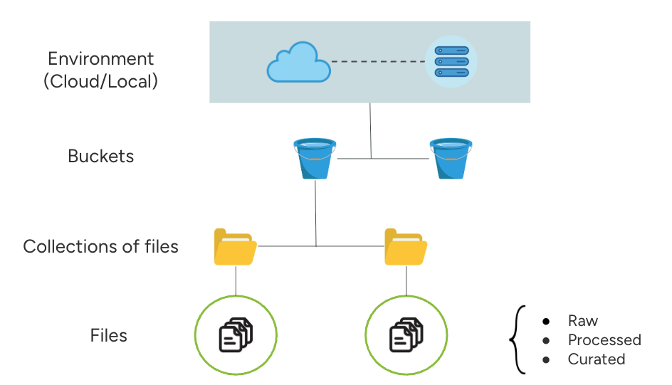

# Lakehouse App - R Lib

This R lib supports the access to the lakehouse app via R scripts

## 📌 Installation and usage

To intall the library:

```r
install.packages("devtools")
library("devtools")

devtools::install_github("danilo-dcs/lakehouse-R-package", upgrade = "always", dependencies = TRUE)
```

To import the main class add the following code into your script:

```r
library(LakehouseClient)
```

To use the lakehouse functionalities create an instance of LakehouseClient by running:

```r
client <- setup_client("lakehouse_app_url")
```

## Lakehouse Data Storage Structure

The lakehouse storage structure is divided in three levels: 
- (1) The bucket where the collections of files will be phisically stored, 
- (2) The collections are a logical group of files (similarly to a github repository of files grouped for the same logical purpose).
- (3) The files



_If you are facing issues to install the LakehouseClient library and it's dependencies on RStudio, please try to create a new empty RStudio project and the import the LakehouseClient library_.
_Alternativelly, you can also set up an R environment on Google Colab or Jupyter_.

## 📚 Function Index

### Authentication

- [client$auth()](#clientauth)

### Creating collection

- [client$create_collection()](#clientcreate_collection)

### Downloading Files

- [client$download_file()](#clientdownload_file)

### Downloading and parsing dataframe

- [client$get_dataframe()](#clientget_dataframe)

### Listing Collections, files and buckets

- [client$list_collections()](#clientlist_collections)
- [client$list_collections_json()](#clientlist_collections_json)<br><br>

- [client$list_files()](#clientlist_files)
- [client$list_files_json()](#clientlist_files_json)<br><br>

- [client$list_buckets()](#clientlist_buckets)
- [client$list_buckets_json()](#clientlist_buckets_json)<br><br>

- [client$upload_dataframe()](#clientupload_dataframe)
- [client$upload_file()](#clientupload_file)

### Search the lakehouse catalog

- [client$search_collections_by_keyword()](#clientsearch_collections_by_keyword)
- [client$search_collections_query](#clientsearch_collections_catalogue)<br><br>

- [client$search_files_by_keyword()](#clientsearch_files_by_keyword)
- [client$search_files_query()](#clientsearch_files_query)

## 🔧 Function Details

### `client$auth("email", "password")` <a name="clientauth">:</a>

**Description:**  
Authenticates the user based on login details. It returns the authentication token.

---

### `client$create_collection("storage_type", "collection_name", "bucket_name", "collection_description", public = TRUE, secret = FALSE)` <a name="clientcreate_collection">:</a>

**Description:**  
Creates a new collection of files. Returns the collection's name.

**Parameters:**

- `storage_type`: storage type for the collection ('gcs', 's3', 'hdfs')
- `collection_name`: name for the new collection
- `bucket_name`: required for GCP/S3/HDFS
- `collection_description [Optional]`: text description
- `public [Optional]`: marks the collection as public
- `secret [Optional]`: marks the collection as secret

**Returns:**

- A dictionary containing the collection item in the catalog

---

### `client$download_file("catalog_file_id", "output_file_dir")` <a name="clientdownload_file">:</a>

**Description:**  
Downloads a file from the lakehouse catalog using its catalog ID. Returns the local path where the file was saved.

**Parameters:**

- `catalog_file_id`: the file id
- `output_file_dir`: the local dir where the output file will be placed at

**Returns:**

- A string containing the output file address

---

### `client$get_dataframe("catalogue_file_id")` <a name="clientget_dataframe">:</a>

**Description:**  
Get a file as a dataframe.  
**Condition:**  
The file must be CSV, XLSX, TSV, JSON, MD, HTML, TEX, or PARQUET. Only works if the catalog marks the file as 'structured'.  
**Parameters:**

- `catalogue_file_id`: the file ID in the catalog

**Returns:**

- It returns a pandas dataframe of the desired file

---

### `client$list_collections("sort_by_key", sort_desc = FALSE)` <a name="clientlist_collections">:</a>

**Description**
List all available collections.

**Arguments**

- sort_by_key (Optional): String containing the key parameter to be the sorting reference, default is inserted_at (date of insertion)
- sort_desc (Optional): Boolean value indicating TRUE or FALSE for sorting descendently

**Returns**
Returns a table-formatted string with the collections records. cat() command is recommended to visualize the formatted table

---

### `client$list_collections_json("sort_by_key", sort_desc = FALSE)` <a name="clientlist_collections_json">:</a>

**Description**
List all available collections.

**Arguments**

- sort_by_key (Optional): String containing the key parameter to be the sorting reference, default is inserted_at (date of insertion)
- sort_desc (Optional): Boolean value indicating TRUE or FALSE for sorting descendently

**Returns**
Returns a json-formatted string with the collections records

---

### `client$list_files(include_raw = TRUE, include_processed = TRUE, include_curated = TRUE, "sort_by_key", sort_desc = FALSE)` <a name="clientlist_files">:</a>

List files in a given collection or bucket.  
**Description**:

Useful for exploring available resources before querying or downloading.

**Arguments**

- include_raw (Optional): Boolead flag indicating if results will whether include raw files
- include_processed (Optional): Boolead flag indicating if results will whether include processed files
- curated (Optional): Boolead flag indicating if results will whether include curated files
- sort_by_key (Optional): String containing the key parameter to be the sorting reference, default is inserted_at (date of insertion)
- sort_desc (Optional): Boolean value indicating TRUE or FALSE for sorting descendently

**Returns:**

- It returns a table-formatted string with the files in the catalog. cat() command is recommended to visualize the formatted table

---

### `client$list_files_json()` <a name="clientlist_files_json">:</a>

List files in a given collection or bucket.  
**Description**:

Useful for exploring available resources before querying or downloading.

**Arguments**

- include_raw (Optional): Boolead flag indicating if results will whether include raw files
- include_processed (Optional): Boolead flag indicating if results will whether include processed files
- curated (Optional): Boolead flag indicating if results will whether include curated files
- sort_by_key (Optional): String containing the key parameter to be the sorting reference, default is inserted_at (date of insertion)
- sort_desc (Optional): Boolean value indicating TRUE or FALSE for sorting descendently

**Returns:**

- It returns a json-formatted string with the files in the catalog

---

### `client$list_buckets()` <a name="clientlist_buckets">:</a>

List all buckets accessible by the user.  
**Description**:
Buckets represent logical data partitions or storage spaces.

**Returns:**

- It returns a table-formatted string containing all the storage buckets in the system, cat() command is recommended to visualize the formatted table

---

### `client$list_buckets_json()` <a name="clientlist_buckets_json">:</a>

List all buckets accessible by the user.  
**Description**:
Buckets represent logical data partitions or storage spaces.

**Returns:**

- It returns a json-formatted string containing all the storage buckets in the system

---

### `client$upload_dataframe("df_name", "collection_catalog_id", "file_description", version = 1, public = TRUE)` <a name="clientupload_dataframe">:</a>

Upload a pandas DataFrame to the lakehouse.

**Description**:

Prepares a new file for upload from local storage. This operation returns the following:

- Upload token
- Credential ID
- Local dataframe file path to be uploaded

Function Arguments\*\*:

- `df_name`:  
  The name of the dataframe (without file extension). The dataframe will be stored as a CSV file by default.

- `collection_catalog_id`:  
  The identifier of the collection (from the collection catalog) where the file will be stored.

- `file_description` _(Optional)_:  
  Additional description for the file.

- `dataframe_version` _(Optional, default: `1`)_:  
  Version number of the dataframe in the system.

- `public` _(Optional, default: `False`)_:  
  Visibility setting. If `True`, the dataframe will be publicly visible to all users in the catalog.

- `processing_level` _(Optional, default: `raw`)_:  
  Indicates the processing level of the dataframe (e.g., `raw`, `processed`, etc.).

---

### `client$upload_file("local_file_path", "final_file_name", "collection_catalog_id", "file_category", "file_description", file_version = 1, public = TRUE, "processing_level")` <a name="clientupload_file">:</a>

**Description:**  
Set up a new file to be uploaded from local storage. It returns the catalog item for the new file uploaded.  
**Parameters:**

- `local_file_path`: the local path to the file to be uploaded
- `final_file_name`: the output file name in the storage
- `collection_catalog_id`: the collection identifier, from the collection catalog, where the file will be placed
- `file_category`: the file class must indicate if the file is 'structured' or 'unstructured'; default is 'unstructured'
- `file_description [Optional]`: Additional description for the file
- `file_version [Optional, default 1]`: Version number for version control
- `public [Optional, default False]`: If public, the file is visible to all users
- `processing_level [Optional]`: The processing level ("raw", "processed", "curated")

**Returns:**

- A dictionary containing the file id in the catalog and the file name

---

### `client$search_collections_by_keyword("keyword")` <a name="clientsearch_collections_by_keyword">:</a>

**Description**: Search the collections in the catalogue by keyword. Enables discovery of collections of datasets based on a specified keyword

**Function Arguments**:

- keyword (str): A string containing the string keyword to match with the collection names (collection_name)

**Returns:**

- It returns the collections reccords in the specified output format.

---

### `client$search_collections_query(...)` <a name="clientsearch_collections_query">:</a>

**Description**: Query the collections in the catalogue based on query parameters. Enables discovery of collections of datasets based on a specified keyword

**Returns:**

- It returns the collection records in the specified parameters

**Function Arguments**:

- ...: String args containing the search terms

**Search Terms Structure**:

"SEARCH_PARAMETER[OPERATOR]VALUE"

- SEARCH_PARAMETER: must be one of the query parameters listed below
- OPERATOR: must be one of the following "=", ">","<", ">=", "<=" or the wildcard operator "\*" (substring match)
- VALUE: Value for each parameter

**Search Parameters List**:

- `id`
- `collection_name`
- `storage_type`
- `location`
- `inserted_by`
- `inserted_at`
- `collection_description`
- `public`

**Example**:

```python
client$search_collections_query("collection_name*lake","inserted_by=user1@gmail.com","inserted_at>1747934722", "public=True")
```

```python
client$search_collections_query("collection_name=covid-cases")
```

---

### `client$search_files_by_keyword("keyword")` <a name="clientsearch_files_by_keyword">:</a>

**Description**: Search the files in the catalogue by keyword. Enables discovery of files of datasets based on a specified keyword

**Function Arguments**:

- keyword (str): A string containing the string keyword to match with the file names

**Returns:**

- It returns the files reccords in the specified output format.

---

### `client$search_files_query(...)` <a name="clientsearch_files_query">:</a>

**Description**: Query the files in the catalogue based on query parameters. Enables discovery of collections of datasets based on a specified keyword

**Returns:**

- It returns the file records in the specified parameters

**Function Arguments**:

- ...: String args containing the search terms

**Search Terms Structure**:

"SEARCH_PARAMETER[OPERATOR]VALUE"

- SEARCH_PARAMETER: must be one of the query parameters listed below
- OPERATOR: must be one of the following "=", ">","<", ">=", "<=" or the wildcard operator "\*" (substring match)
- VALUE: Value for each parameter

**Search Parameters List**:

- `id`
- `file_name`
- `file_size`
- `collection_id`
- `collection_name`
- `processing_level`
- `inserted_by`
- `inserted_at`
- `file_category`
- `file_version`
- `public`

**Example**:

```r
client$search_files_query("file_name*zika","inserted_by=user1@gmail.com","inserted_at>1747934722", "public=True", "processing_level=raw", "file_category=structured")
```

```r
client$search_files_query("file_name=zeros.zip")
```

---
